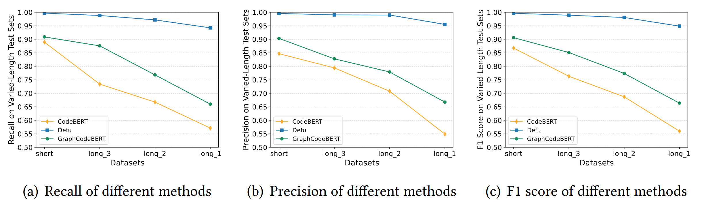

# Defu: Optimizing Semantic Code Clone Detection through Execution Path Decomposition and Embedding Fusion

[](https://doi.org/10.5281/zenodo.13759181)


## Task Definition

Given one code pair as the input, the task is to do binary classification (0/1), where 1 stands for clone code and 0 for non-clone code. Models are evaluated by F1 score.

## Directory Structure

- src: source code of Defu and scripts to run experiments
- dataset: our dataset
- models: the pre-trained CodeBERT model and the pre-trained GraphCodeBERT model, both of which can be obtained from hugging face
- parserTool: the tool of Tree-sitter

## Prepare Requirements

- Python: 3.8.18
- Pytorch: 2.1.2
- networkx: 3.1
- tree-sitter: 0.20.2

## Tree-sitter (optional)

Before running the program, if the built file "parserTool/my-languages.so" doesn't work for you, please rebuild as the following command and modify the file path in the parse.py file:

```shell
cd parserTool
bash build.sh
cd ..
```

## Dataset

In our study, we carry out experiments on two primary datasets: BigCloneBench (BCB) and Google Code Jam (GCJ) . 

The BCB dataset is a well-known and extensive code clone benchmark that includes more than eight million labeled clone pairs derived from 25,000 different systems. We choose the BCB dataset because its function-level code granularity matches the detection granularity of Defu. Importantly, the clone pairs within the BCB dataset are categorized into various types, facilitating our evaluation across different clone types. Given that the BCB dataset includes only 278,838 non-clone pairs, we randomly sampled 270,000 pairs each from the clone and non-clone sets to maintain dataset balance. Our selection from the clone set comprises 48,116 Type-1 (T1) clone pairs, 4,234 Type-2 (T2) clone pairs, 21,395 ST3 clone pairs, 86,341 MT3 clone pairs, and 109,914 WT3/T4 clone pairs.We divided all clone pairs and non-clone pairs into training, evaluation, and test subsets with an 8:1:1 ratio. Subsequently, we synthesized the subsets into the training set, evaluation set, and test set, respectively.

The second dataset, known as GCJ, includes 1,669 projects obtained from an online programming competition organized by Google. These projects provide solutions to 12 distinct competition problems and are created by various programmers. Although projects solving the same problem may show syntactical differences, they possess semantic similarities and are therefore treated as clone pairs. In contrast, projects solving different problems are considered dissimilar and categorized as non-clone pairs. Our dataset contains 275,570 semantic clone pairs and 1,116,376 non-clone pairs. To maintain balance within the dataset, we randomly select 270,000 pairs from the clone set and an equal number from the non-clone set.
For the GCJ database, the treatment is the same as for the BCB dataset.

### Data Format

train.jsonl/valid.jsonl/test.jsonl are stored in jsonlines format. Each line in the uncompressed file represents one function. One row is illustrated below.

- **code1:** code of the function 1
- **idx1:** index of the function 1
- **code2:** code of the function 2
- **idx2:** index of the function 2
- **label:** the label of the pair

## Preprocess

```shell
# BCB
python data_process_embeddings_3_BCB.py
	--model_type=roberta \
    --tokenizer_name=../models/graphcodebert \
    --model_name_or_path=../models/graphcodebert \
    --block_size 512 \
    --seed 123456 
# GCJ
python data_process_embeddings_3_GCJ.py
	--model_type=roberta \
    --tokenizer_name=../models/graphcodebert \
    --model_name_or_path=../models/graphcodebert \
    --block_size 512 \
    --seed 123456 
```


## Train

```shell
python run_loss.py \
	--output_dir=./saved_models \
	--model_type=roberta \
    --tokenizer_name=../models/graphcodebert \
    --model_name_or_path=../models/graphcodebert \
    --do_train \
    --train_data_file=datasets/BCB/train.jsonl \
    --eval_data_file=datasets/BCB/eval.jsonl \
    --test_data_file=datasets/BCB/test.jsonl \
    --epoch 2 \
    --block_size 512 \
    --train_batch_size 36 \
    --eval_batch_size 36 \
    --learning_rate 1e-4 \
    --max_grad_norm 1.0 \
    --evaluate_during_training \
    --seed 123456 \
    --cnn_size 128 \
    --filter_size 3 \
    --d_size 128 \
    --pkl_file=datasets/BCB/preprocess/path_embeddings_3_v2.pk
```


## Evaluation 

```shell
python run_loss.py \
	--output_dir=./saved_models \
	--model_type=roberta \
    --tokenizer_name=../models/graphcodebert \
    --model_name_or_path=../models/graphcodebert \
    --do_eval \
    --train_data_file=datasets/BCB/train.jsonl \
    --eval_data_file=datasets/BCB/eval.jsonl \
    --test_data_file=datasets/BCB/test.jsonl \
    --epoch 2 \
    --block_size 512 \
    --train_batch_size 36 \
    --eval_batch_size 36 \
    --learning_rate 1e-4 \
    --max_grad_norm 1.0 \
    --evaluate_during_training \
    --seed 123456 \
    --cnn_size 128 \
    --filter_size 3 \
    --d_size 128 \
    --pkl_file=datasets/BCB/preprocess/path_embeddings_3_v2.pk
```


## RQ4:Effects on Different Length Code Pairs

```shell
# Get code pairs at each length level
python RQ4_long_dataset.py
	--model_type=roberta \
    --tokenizer_name=../models/graphcodebert \
    --model_name_or_path=../models/graphcodebert \
    --block_size 512 \
    --seed 123456 
```

- short: None of the test code pairs has more than 510 tokens which is the input length limit for \textit{GraphCodeBERT} (75.3% of eval dataset). 
- long\_3: None of the test code pairs has more than 600 tokens, and there is a code snippet in the pair with more than 510 tokens. (11.5% of eval dataset). 
- long\_2: None of the test code pairs has more than 700 tokens, and there is a code snippet in the pair with more than 600 tokens. (5.5% of eval dataset). 
- long\_1: The number of tokens in one code snippet is greater than 700. (7.7% of eval dataset). 



We then test the models obtained from training *Defu*, *CodeBERT*, and *GraphCodeBERT* on each test set separately. In the figure above, we plot the changes in the recall, precision, and F1 score of each method as the code snippet length increases in the test sets.
From the figure, two phenomena become apparent. Firstly, a notable decline in the F1 metrics of every tool is evident with the increasing length of code excerpts within the test corpus. Secondly, *Defu*'s effectiveness in identifying extended code clones shows a significantly lesser decline compared to the other two tools. For instance, the F1 score of *CodeBERT* decreases from 0.8675 to 0.5599, marking a 35.46% decline, with the escalation of code snippet length. *GraphCodeBERT*'s F1 score exhibits a decrease from 0.9060 to 0.6637, indicating a 26.74% drop under similar conditions. In contrast, *Defu*'s F1 score exhibits a modest decrease from 0.9964 to 0.9487, a 4.79%. Even in the most extended long\_1 test scenario, *Defu* maintains an F1 score of 0.9413.


## Parameter details of our comparative tools

| Tool          | Parameters                                                   |
| ------------- | ------------------------------------------------------------ |
| SourcererCC   | Min lines: 6, Similarity threshold: 0.7                      |
| Deckard       | Min tokens: 100, Stride: 2, Similarity threshold: 0.9        |
| RtvNN         | RtNN phase: hidden layer size: 400, epoch: 25, λ1 for L2 regularization: 0.005, Initial learning rate: 0.003, Clipping gradient range: (-5.0, 5.0), RtvNN phase: hidden layer size: (400, 400)-400, epoch: 5, Initial learning rate: 0.005, λ1 for L2 regularization: 0.005, Distance threshold: 2.56 |
| ASTNN         | symbols embedding size: 128, hidden dimension: 100, mini-batch: 64, epoch: 5, threshold: 0.5, learning rate of AdaMax: 0.002 |
| SCDetector    | distance measure: Cosine distance, dimension of token vector: 100, threshold: 0.5, learning rate: 0.0001 |
| DeepSim       | Layers size: 88-6, (128x6-256-64)-128-32, epoch: 4, Initial learning rate: 0.001, λ for L2 regularization: 0.00003, Dropout: 0.75 |
| CDLH          | Code length 32 for learned binary hash codes, size of word embeddings: 100 |
| TBCNN         | Convolutional layer dim size: 300， dropout rate: 0.5, batch size: 10 |
| FCCA          | Size of hidden states: 128(Text), 128(AST), embedding size: 300(Text), 300(AST), 64(CFG) clipping gradient range: (-1.2，1.2), epoch: 50, initial learning rate: 0.0005, dropout:0.6, batchsize: 32 |
| CodeBERT      | epoch:2  block_size:510  train_batch_size:36  eval_batch_size:36  learning_rate:1e-4  max_grad_norm:1.0 |
| GraphCodeBERT | epoch:2  block_size:510  train_batch_size:36  eval_batch_size:36  learning_rate:1e-4  max_grad_norm:1.0 |


## Descriptions of used metrics in experiments

| Metrics        | Abbr | Definition                                         |
| -------------- | ---- | -------------------------------------------------- |
| True Positive  | TP   | #samples correctly classified as clone pairs       |
| True Negative  | TN   | #samples correctly classified as non-clone pairs   |
| False Positive | FP   | #samples incorrectly classified as clone pairs     |
| False Negative | FN   | #samples incorrectly classified as non-clone pairs |
| Precision      | P    | TP/(TP+FP)                                         |
| Recall         | R    | TP/(TP+FN)                                         |
| F-measure      | F1   | 2*P*R/(P+R)                                        |
